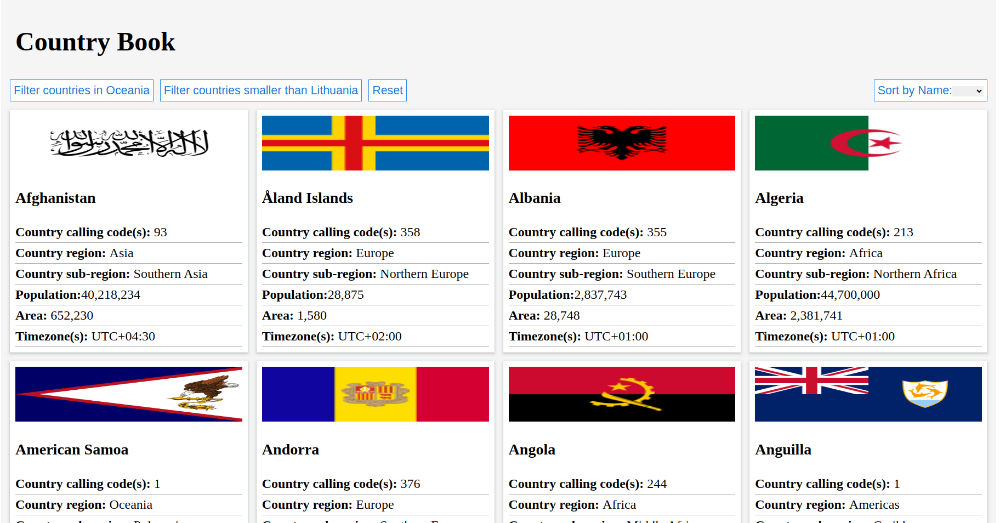

# Country Book

Country Book is a web application built with React.js that fetches data from an API endpoint and displays information about countries. It allows you to sort the countries alphabetically by name and filter them based on specific criteria.

## Preview


## Features

- Fetches data from the API endpoint to display information about countries worldwide.
- Displays a list of countries in a card format.
- Allows sorting of the country list alphabetically by name (ascending and descending).
- Implements filters to narrow down the displayed countries:
  - Filters countries smaller than Lithuania by area.
  - Filters countries in the "Oceania" region.

## Components

The project consists of the following components:

1. `CountryData`: The main component that handles fetching the data, sorting, and filtering the country list.

2. `CountryItemView`: Renders the individual country card with relevant information.

3. `App`: The entry point of the application that renders the main `CountryData` component.

## Installation and Usage

1. Clone the repository from GitHub:

   ```bash
   git clone https://github.com/Stensis/countries-display-book.git

2. Install the dependencies:
   cd countries-display-book
   npm install

3. Start the development server:  npm start.

4. Open your browser and visit http://localhost:3000 to view the application.

## Styling
The application is styled using CSS modules. The styles are organized in separate CSS files for each component, namely countryData.module.css and countryItem.module.css.

## Credits
The project is developed by Irene Njuguna. You can find the code on GitHub.


